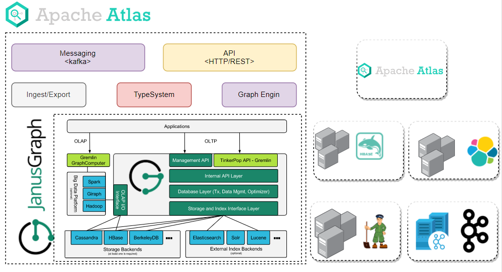
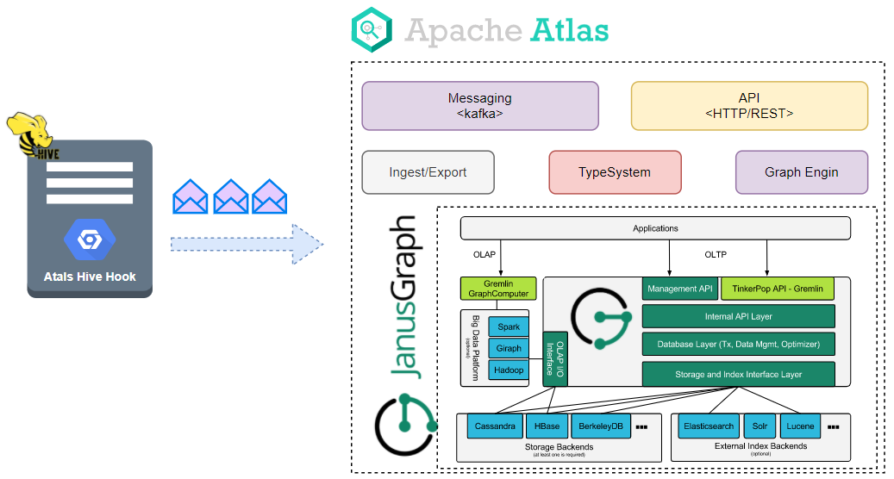
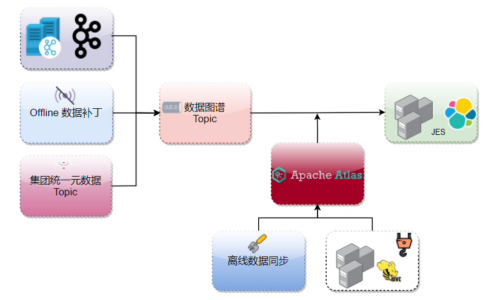
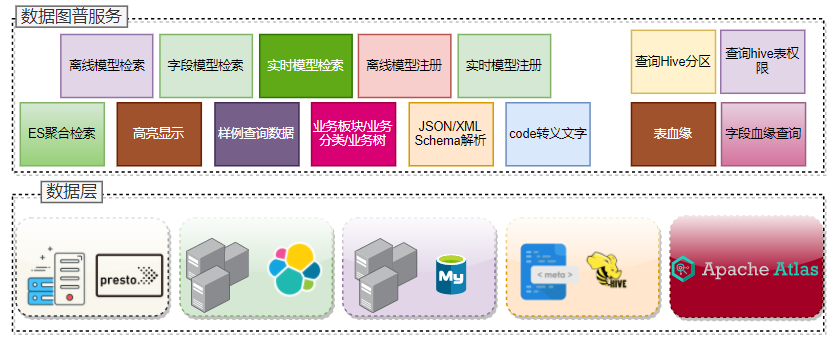

## Atlas Server Deploy Manual

### Architecture



### Resource Node
| ip                                                           | server                   | cluster                  |
| ------------------------------------------------------------ | ------------------------ | ------------------------ |
| 10.220.87.154                                                | zookeeper、Elasticsearch | SmartJtlas-Elasticsearch |
| 10.220.87.249                                                | zookeeper、Elasticsearch | SmartJtlas-Elasticsearch |
| 10.220.87.38                                                 | zookeeper、Elasticsearch | SmartJtlas-Elasticsearch |
| 10.220.87.13                                                 | kafka                    | SmartJtlas-Elasticsearch |
| 10.220.87.17                                                 | kafka                    | SmartJtlas-Elasticsearch |
| 10.220.87.26                                                 | kafka                    | SmartJtlas-Elasticsearch |
| 10.220.87.191                                                | atlas                    | SmartJtlas-Elasticsearch |
| 10.220.87.47                                                 | atlas                    | SmartJtlas-Elasticsearch |
| 10.220.72.185（HRegionServer）<br/>10.220.72.193（HRegionServer）<br/>10.220.72.184（HRegionServer）<br/>10.220.72.204（HRegionServer）<br/>10.220.72.175（HRegionServer）<br/>10.220.72.203（Zookeeper/HRegionServer）<br/>10.220.72.183（HMaster/Zookeeper/HRegionServer）<br/>10.220.72.194（HRegionServer）<br/>10.220.72.174（HMaster/Zookeeper/HRegionServer） | Hbase                    | ops-pub-hbase            |

### Deploy

1.untar `apache-atlas-2.1.0-bin.tar.gz` file，

```shell
[supdev@TX-220-87-191 ~]$ ls -l /export/server
total 473540
drwxrwxrwx 11 root root      4096 Mar 22 13:06 apache-atlas-2.1.0
```

we over write the files under the`models` directory  because of our special application scenarios. if you don't need to modify the models files,just keep them remain unchanged. you should ensure you have installed jdk1.8 under you deploy  environment .

2. edit `atlas-application.properties` 

```properties
#
# Licensed to the Apache Software Foundation (ASF) under one
# or more contributor license agreements.  See the NOTICE file
# distributed with this work for additional information
# regarding copyright ownership.  The ASF licenses this file
# to you under the Apache License, Version 2.0 (the
# "License"); you may not use this file except in compliance
# with the License.  You may obtain a copy of the License at
#
#     http://www.apache.org/licenses/LICENSE-2.0
#
# Unless required by applicable law or agreed to in writing, software
# distributed under the License is distributed on an "AS IS" BASIS,
# WITHOUT WARRANTIES OR CONDITIONS OF ANY KIND, either express or implied.
# See the License for the specific language governing permissions and
# limitations under the License.
#
#########  Config Cluster MetaInfo  #########

atlas.metadata.namespace=5k

#########  Graph Database Configs  #########

# Graph Database

#Configures the graph database to use.  Defaults to JanusGraph
#atlas.graphdb.backend=org.apache.atlas.repository.graphdb.janus.AtlasJanusGraphDatabase

# Graph Storage
# Set atlas.graph.storage.backend to the correct value for your desired storage
# backend. Possible values:
#
# hbase
# cassandra
# embeddedcassandra - Should only be set by building Atlas with  -Pdist,embedded-cassandra-solr
# berkeleyje
#
# See the configuration documentation for more information about configuring the various  storage backends.
#
atlas.graph.storage.backend=hbase2
atlas.graph.storage.hbase.table=smartjtlas:apache_atlas_janus

#Hbase
#For standalone mode , specify localhost
#for distributed mode, specify zookeeper quorum here
atlas.graph.storage.hostname=10.220.72.203:2181,10.220.72.183:2181,10.220.72.174:2181
atlas.graph.storage.hbase.regions-per-server=1
atlas.graph.storage.lock.wait-time=10000

#In order to use Cassandra as a backend, comment out the hbase specific properties above, and uncomment the
#the following properties
#atlas.graph.storage.clustername=
#atlas.graph.storage.port=

# Gremlin Query Optimizer
#
# Enables rewriting gremlin queries to maximize performance. This flag is provided as
# a possible way to work around any defects that are found in the optimizer until they
# are resolved.
#atlas.query.gremlinOptimizerEnabled=true

# Delete handler
#
# This allows the default behavior of doing "soft" deletes to be changed.
#
# Allowed Values:
# org.apache.atlas.repository.store.graph.v1.SoftDeleteHandlerV1 - all deletes are "soft" deletes
# org.apache.atlas.repository.store.graph.v1.HardDeleteHandlerV1 - all deletes are "hard" deletes
#
atlas.DeleteHandlerV1.impl=org.apache.atlas.repository.store.graph.v1.HardDeleteHandlerV1

# Entity audit repository
#
# This allows the default behavior of logging entity changes to hbase to be changed.
#
# Allowed Values:
# org.apache.atlas.repository.audit.HBaseBasedAuditRepository - log entity changes to hbase
# org.apache.atlas.repository.audit.CassandraBasedAuditRepository - log entity changes to cassandra
# org.apache.atlas.repository.audit.NoopEntityAuditRepository - disable the audit repository
#
atlas.EntityAuditRepository.impl=org.apache.atlas.repository.audit.HBaseBasedAuditRepository

# if Cassandra is used as a backend for audit from the above property, uncomment and set the following
# properties appropriately. If using the embedded cassandra profile, these properties can remain
# commented out.
# atlas.EntityAuditRepository.keyspace=atlas_audit
# atlas.EntityAuditRepository.replicationFactor=1

# Graph Search Index
atlas.graph.index.search.backend=elasticsearch

#Solr
#Solr cloud mode properties
#atlas.graph.index.search.solr.mode=cloud
#atlas.graph.index.search.solr.zookeeper-url=
#atlas.graph.index.search.solr.zookeeper-connect-timeout=60000
#atlas.graph.index.search.solr.zookeeper-session-timeout=60000
#atlas.graph.index.search.solr.wait-searcher=true

#Solr http mode properties
#atlas.graph.index.search.solr.mode=http
#atlas.graph.index.search.solr.http-urls=http://localhost:8983/solr

# ElasticSearch support (Tech Preview)
# Comment out above solr configuration, and uncomment the following two lines. Additionally, make sure the
# hostname field is set to a comma delimited set of elasticsearch master nodes, or an ELB that fronts the masters.
#
# Elasticsearch does not provide authentication out of the box, but does provide an option with the X-Pack product
# https://www.elastic.co/products/x-pack/security
#
# Alternatively, the JanusGraph documentation provides some tips on how to secure Elasticsearch without additional
# plugins: https://docs.janusgraph.org/latest/elasticsearch.html
atlas.graph.index.search.hostname=10.220.87.154:9200,10.220.87.249:9200,10.220.87.38:9200
atlas.graph.index.search.elasticsearch.client-only=true

# Solr-specific configuration property
atlas.graph.index.search.max-result-set-size=150

#########  Import Configs  #########
#atlas.import.temp.directory=/temp/import

#########  Notification Configs  #########
atlas.notification.embedded=false
atlas.kafka.data=${sys:atlas.home}/data/kafka
#atlas.kafka.zookeeper.connect=10.220.87.38:2181,10.220.87.249:2181,10.220.87.154:2181/kafka
atlas.kafka.bootstrap.servers=10.220.87.13:9092,10.220.87.17:9092,10.220.87.26:9092
atlas.kafka.zookeeper.session.timeout.ms=400
atlas.kafka.zookeeper.connection.timeout.ms=200
atlas.kafka.zookeeper.sync.time.ms=20
atlas.kafka.auto.commit.interval.ms=1000
atlas.kafka.hook.group.id=atlas

atlas.kafka.enable.auto.commit=false
atlas.kafka.auto.offset.reset=earliest
atlas.kafka.session.timeout.ms=30000
atlas.kafka.offsets.topic.replication.factor=1
atlas.kafka.poll.timeout.ms=1000

atlas.notification.create.topics=true
atlas.notification.replicas=1
atlas.notification.topics=ATLAS_HOOK,ATLAS_ENTITIES
atlas.notification.log.failed.messages=true
atlas.notification.consumer.retry.interval=500
atlas.notification.hook.retry.interval=1000
# Enable for Kerberized Kafka clusters
#atlas.notification.kafka.service.principal=kafka/_HOST@EXAMPLE.COM
#atlas.notification.kafka.keytab.location=/etc/security/keytabs/kafka.service.keytab

## Server port configuration
#atlas.server.http.port=21000
#atlas.server.https.port=21443

#########  Security Properties  #########

# SSL config
atlas.enableTLS=false

#truststore.file=/path/to/truststore.jks
#cert.stores.credential.provider.path=jceks://file/path/to/credentialstore.jceks

#following only required for 2-way SSL
#keystore.file=/path/to/keystore.jks

# Authentication config

atlas.authentication.method.kerberos=false
atlas.authentication.method.file=true

#### ldap.type= LDAP or AD
atlas.authentication.method.ldap.type=none

#### user credentials file
atlas.authentication.method.file.filename=${sys:atlas.home}/conf/users-credentials.properties

### groups from UGI
#atlas.authentication.method.ldap.ugi-groups=true

######## LDAP properties #########
#atlas.authentication.method.ldap.url=ldap://<ldap server url>:389
#atlas.authentication.method.ldap.userDNpattern=uid={0},ou=People,dc=example,dc=com
#atlas.authentication.method.ldap.groupSearchBase=dc=example,dc=com
#atlas.authentication.method.ldap.groupSearchFilter=(member=uid={0},ou=Users,dc=example,dc=com)
#atlas.authentication.method.ldap.groupRoleAttribute=cn
#atlas.authentication.method.ldap.base.dn=dc=example,dc=com
#atlas.authentication.method.ldap.bind.dn=cn=Manager,dc=example,dc=com
#atlas.authentication.method.ldap.bind.password=<password>
#atlas.authentication.method.ldap.referral=ignore
#atlas.authentication.method.ldap.user.searchfilter=(uid={0})
#atlas.authentication.method.ldap.default.role=<default role>


######### Active directory properties #######
#atlas.authentication.method.ldap.ad.domain=example.com
#atlas.authentication.method.ldap.ad.url=ldap://<AD server url>:389
#atlas.authentication.method.ldap.ad.base.dn=(sAMAccountName={0})
#atlas.authentication.method.ldap.ad.bind.dn=CN=team,CN=Users,DC=example,DC=com
#atlas.authentication.method.ldap.ad.bind.password=<password>
#atlas.authentication.method.ldap.ad.referral=ignore
#atlas.authentication.method.ldap.ad.user.searchfilter=(sAMAccountName={0})
#atlas.authentication.method.ldap.ad.default.role=<default role>

#########  JAAS Configuration ########

#atlas.jaas.KafkaClient.loginModuleName = com.sun.security.auth.module.Krb5LoginModule
#atlas.jaas.KafkaClient.loginModuleControlFlag = required
#atlas.jaas.KafkaClient.option.useKeyTab = true
#atlas.jaas.KafkaClient.option.storeKey = true
#atlas.jaas.KafkaClient.option.serviceName = kafka
#atlas.jaas.KafkaClient.option.keyTab = /etc/security/keytabs/atlas.service.keytab
#atlas.jaas.KafkaClient.option.principal = atlas/_HOST@EXAMPLE.COM

#########  Server Properties  #########
atlas.rest.address=http://10.220.87.191:21000,http://10.220.87.47:21000
# If enabled and set to true, this will run setup steps when the server starts
#atlas.server.run.setup.on.start=false

#########  Entity Audit Configs  #########
atlas.audit.hbase.tablename=smartjtlas:apache_atlas_entity_audit
atlas.audit.zookeeper.session.timeout.ms=1000
atlas.audit.hbase.zookeeper.quorum=10.220.72.203:2181,10.220.72.183:2181,10.220.72.174:2181

#########  High Availability Configuration ########
atlas.server.ha.enabled=true
#### Enabled the configs below as per need if HA is enabled #####
atlas.server.ids=id1,id2
atlas.server.address.id1=10.220.87.191:21000
atlas.server.address.id2=10.220.87.47:21000
atlas.server.ha.zookeeper.connect=10.220.87.38:2181,10.220.87.249:2181,10.220.87.154:2181
atlas.server.ha.zookeeper.retry.sleeptime.ms=1000
atlas.server.ha.zookeeper.num.retries=3
atlas.server.ha.zookeeper.session.timeout.ms=20000
## if ACLs need to be set on the created nodes, uncomment these lines and set the values ##
#atlas.server.ha.zookeeper.acl=<scheme>:<id>
#atlas.server.ha.zookeeper.auth=<scheme>:<authinfo>

######### Atlas Authorization #########
atlas.authorizer.impl=simple
atlas.authorizer.simple.authz.policy.file=atlas-simple-authz-policy.json

#########  Type Cache Implementation ########
# A type cache class which implements
# org.apache.atlas.typesystem.types.cache.TypeCache.
# The default implementation is org.apache.atlas.typesystem.types.cache.DefaultTypeCache which is a local in-memory type cache.
#atlas.TypeCache.impl=

#########  Performance Configs  #########
#atlas.graph.storage.lock.retries=10
#atlas.graph.storage.cache.db-cache-time=120000

#########  CSRF Configs  #########
atlas.rest-csrf.enabled=true
atlas.rest-csrf.browser-useragents-regex=^Mozilla.*,^Opera.*,^Chrome.*
atlas.rest-csrf.methods-to-ignore=GET,OPTIONS,HEAD,TRACE
atlas.rest-csrf.custom-header=X-XSRF-HEADER

############ KNOX Configs ################
#atlas.sso.knox.browser.useragent=Mozilla,Chrome,Opera
#atlas.sso.knox.enabled=true
#atlas.sso.knox.providerurl=https://<knox gateway ip>:8443/gateway/knoxsso/api/v1/websso
#atlas.sso.knox.publicKey=

############ Atlas Metric/Stats configs ################
# Format: atlas.metric.query.<key>.<name>
atlas.metric.query.cache.ttlInSecs=900
#atlas.metric.query.general.typeCount=
#atlas.metric.query.general.typeUnusedCount=
#atlas.metric.query.general.entityCount=
#atlas.metric.query.general.tagCount=
#atlas.metric.query.general.entityDeleted=
#
#atlas.metric.query.entity.typeEntities=
#atlas.metric.query.entity.entityTagged=
#
#atlas.metric.query.tags.entityTags=

#########  Compiled Query Cache Configuration  #########

# The size of the compiled query cache.  Older queries will be evicted from the cache
# when we reach the capacity.

#atlas.CompiledQueryCache.capacity=1000

# Allows notifications when items are evicted from the compiled query
# cache because it has become full.  A warning will be issued when
# the specified number of evictions have occurred.  If the eviction
# warning threshold <= 0, no eviction warnings will be issued.

#atlas.CompiledQueryCache.evictionWarningThrottle=0


#########  Full Text Search Configuration  #########

#Set to false to disable full text search.
#atlas.search.fulltext.enable=true

#########  Gremlin Search Configuration  #########

#Set to false to disable gremlin search.
atlas.search.gremlin.enable=false


########## Add http headers ###########

#atlas.headers.Access-Control-Allow-Origin=*
#atlas.headers.Access-Control-Allow-Methods=GET,OPTIONS,HEAD,PUT,POST
#atlas.headers.<headerName>=<headerValue>


#########  UI Configuration ########

atlas.ui.default.version=v1
```

3. edit `atlas-env.sh`

```shell
#!/usr/bin/env bash
#
# Licensed to the Apache Software Foundation (ASF) under one
# or more contributor license agreements.  See the NOTICE file
# distributed with this work for additional information
# regarding copyright ownership.  The ASF licenses this file
# to you under the Apache License, Version 2.0 (the
# "License"); you may not use this file except in compliance
# with the License.  You may obtain a copy of the License at
#
#     http://www.apache.org/licenses/LICENSE-2.0
#
# Unless required by applicable law or agreed to in writing, software
# distributed under the License is distributed on an "AS IS" BASIS,
# WITHOUT WARRANTIES OR CONDITIONS OF ANY KIND, either express or implied.
# See the License for the specific language governing permissions and
# limitations under the License.
#
# The java implementation to use. If JAVA_HOME is not found we expect java and jar to be in path
export JAVA_HOME=/usr/java/latest
export HBASE_CONF_DIR=/export/server/apache-atlas-2.1.0/conf/hbase
# any additional java opts you want to set. This will apply to both client and server operations
#export ATLAS_OPTS="-Xmx8g -Xms8g"

# any additional java opts that you want to set for client only
#export ATLAS_CLIENT_OPTS="-Xmx8g -Xms8g"

# java heap size we want to set for the client. Default is 1024MB
#export ATLAS_CLIENT_HEAP="-Xmx8g -Xms8g"

# any additional opts you want to set for atlas service.
#export ATLAS_SERVER_OPTS="-Xmx8g -Xms8g"

# indicative values for large number of metadata entities (equal or more than 10,000s)
export ATLAS_SERVER_OPTS="-server -XX:SoftRefLRUPolicyMSPerMB=0 -XX:+CMSClassUnloadingEnabled -XX:+UseConcMarkSweepGC -XX:+CMSParallelRemarkEnabled -XX:+PrintTenuringDistribution -XX:+HeapDumpOnOutOfMemoryError -XX:HeapDumpPath=dumps/atlas_server.hprof -Xloggc:logs/gc-worker.log -verbose:gc -XX:+UseGCLogFileRotation -XX:NumberOfGCLogFiles=10 -XX:GCLogFileSize=1m -XX:+PrintGCDetails -XX:+PrintHeapAtGC -XX:+PrintGCTimeStamps"

# java heap size we want to set for the atlas server. Default is 1024MB
#export ATLAS_SERVER_HEAP="-Xmx8g -Xms8g"

# indicative values for large number of metadata entities (equal or more than 10,000s) for JDK 8
export ATLAS_SERVER_HEAP="-Xms15360m -Xmx15360m -XX:MaxNewSize=5120m -XX:MetaspaceSize=100M -XX:MaxMetaspaceSize=512m"

# What is is considered as atlas home dir. Default is the base locaion of the installed software
#export ATLAS_HOME_DIR=

# Where log files are stored. Defatult is logs directory under the base install location
#export ATLAS_LOG_DIR=

# Where pid files are stored. Defatult is logs directory under the base install location
#export ATLAS_PID_DIR=

# where the atlas titan db data is stored. Defatult is logs/data directory under the base install location
#export ATLAS_DATA_DIR=

# Where do you want to expand the war file. By Default it is in /server/webapp dir under the base install dir.
#export ATLAS_EXPANDED_WEBAPP_DIR=

# indicates whether or not a local instance of HBase should be started for Atlas
export MANAGE_LOCAL_HBASE=false

# indicates whether or not a local instance of Solr should be started for Atlas
export MANAGE_LOCAL_SOLR=false

# indicates whether or not cassandra is the embedded backend for Atlas
export MANAGE_EMBEDDED_CASSANDRA=false

# indicates whether or not a local instance of Elasticsearch should be started for Atlas
export MANAGE_LOCAL_ELASTICSEARCH=false
```

4. edit `conf/hbase/hbase-site.xml`

```xml
<?xml version="1.0"?>
<?xml-stylesheet type="text/xsl" href="configuration.xsl"?>
<configuration>
    <property>
        <name>hbase.rootdir</name>
        <value>hdfs://ops-pub-hbase/hbase</value>
    </property>

    <property>
        <name>dfs.support.append</name>
        <value>true</value>
    </property>

    <property>
        <name>hbase.replication</name>
        <value>true</value>
    </property>
    <property>
        <name>hbase.client.write.buffer</name>
        <value>16777216</value>
    </property>

    <property>
        <name>hbase.zookeeper.property.maxClientCnxns</name>
        <value>4096</value>
    </property>

    <property>
        <name>hbase.client.pause</name>
        <value>100</value>
    </property>
    <property>
        <name>hbase.client.retries.number</name>
        <value>35</value>
    </property>
    <property>
        <name>hbase.client.scanner.caching</name>
        <value>100</value>
    </property>
    <property>
        <name>hbase.client.keyvalue.maxsize</name>
        <value>10485760</value>
    </property>
    <property>
        <name>hbase.regionserver.thrift.http</name>
        <value>false</value>
    </property>
    <property>
        <name>hbase.master.port</name>
        <value>60000</value>
    </property>
    <property>
        <name>hbase.master.info.port</name>
        <value>60010</value>
    </property>
    <property>
        <name>hbase.regionserver.port</name>
        <value>60020</value>
    </property>
    <property>
        <name>hbase.regionserver.info.port</name>
        <value>60030</value>
    </property>

    <property>
        <name>hbase.cluster.distributed</name>
        <value>true</value>
    </property>

    <property>
        <name>hbase.thrift.support.proxyuser</name>
        <value>false</value>
    </property>
    <property>
        <name>hbase.rpc.timeout</name>
        <value>60000</value>
    </property>
    <property>
        <name>hbase.snapshot.enabled</name>
        <value>true</value>
    </property>
    <property>
        <name>hbase.snapshot.master.timeoutMillis</name>
        <value>60000</value>
    </property>
    <property>
        <name>hbase.snapshot.region.timeout</name>
        <value>60000</value>
    </property>
    <property>
        <name>hbase.snapshot.master.timeout.millis</name>
        <value>60000</value>
    </property>
    <property>
        <name>hbase.security.authentication</name>
        <value>simple</value>
    </property>
    <property>
        <name>zookeeper.session.timeout</name>
        <value>1200000</value>
    </property>

    <property>
        <name>hbase.regionserver.restart.on.zk.expire</name>
        <value>true</value>
    </property>

    <property>
        <name>hbase.regionserver.handler.count</name>
        <value>100</value>
    </property>

    <property>
        <name>ipc.server.max.callqueue.length</name>
        <value>500</value>
    </property>

    <property>
        <name>hbase.ipc.warn.response.time</name>
        <value>400</value>
    </property>

    <property>
        <name>hbase.regionserver.global.memstore.upperLimit</name>
        <value>0.6</value>
    </property>

    <property>
        <name>hbase.regionserver.global.memstore.lowerLimit</name>
        <value>0.5</value>
    </property>

    <property>
        <name>hbase.hregion.memstore.flush.size</name>
        <value>268435456</value>
    </property>

    <property>
        <name>hbase.hregion.memstore.block.multiplier</name>
        <value>2</value>
    </property>

    <property>
        <name>hbase.hstore.blockingStoreFiles</name>
        <value>100</value>
    </property>

    <property>
        <name>hbase.hstore.compaction.max</name>
        <value>10</value>
    </property>

    <property>
        <name>hbase.hstore.compaction.min</name>
        <value>3</value>
    </property>

    <property>
        <name>hbase.master</name>
        <value>60000</value>
    </property>


    <property>
        <name>hbase.zookeeper.quorum</name>
        <value>10.220.72.203:2181,10.220.72.183:2181,10.220.72.174:2181</value>
    </property>

    <property>
        <name>zookeeper.znode.parent</name>
        <value>/hbase</value>
    </property>

    <property>
        <name>hbase.regionserver.optionalcacheflushinterval</name>
        <value>86400000</value>
    </property>

    <property>
        <name>hbase.hregion.majorcompaction</name>
        <value>0</value>
    </property>

    <property>
        <name>hbase.coprocessor.user.region.classes</name>
        <value>org.apache.hadoop.hbase.coprocessor.AggregateImplementation</value>
    </property>

    <property>
        <name>hbase.balancer.period</name>
        <value>1200000</value>
    </property>
    <property>
        <name>hbase.hregion.max.filesize</name>
        <value>53687091200</value>
    </property>
    <property>
        <name>hbase.bucketcache.ioengine</name>
        <value>offheap</value>
    </property>
    <property>
        <name>hfile.block.cache.size</name>
        <value>0.2</value>
    </property>
    <property>
        <name>hbase.bucketcache.size</name>
        <value>1024</value>
    </property>

    <property>
        <name>hbase.regionserver.executor.openregion.threads</name>
        <value>100</value>
    </property>

    <property>
        <name>phoenix.schema.isNamespaceMappingEnabled</name>
        <value>true</value>
    </property>
    <property>
        <name>phoenix.schema.mapSystemTablesToNamespace</name>
        <value>true</value>
    </property>
</configuration>
```

5. ensure you have create `smartjtlas:apache_atlas_entity_audit`and `smartjtlas:apache_atlas_janus`table in your hbase cluster

- smartjtlas:apache_atlas_janus

```shell
create 'smartjtlas:apache_atlas_janus',{NAME => 'e', VERSIONS => '1', EVICT_BLOCKS_ON_CLOSE => 'false', NEW_VERSION_BEHAVIOR => 'false', KEEP_DELETED_CELLS => 'FALSE', CACHE_DATA_ON_WRITE => 'false', DATA_BLOCK_ENCODING => 'NONE', TTL => 'FOREVER', MIN_VERSIONS => '0', REPLICATION_SCOPE => '0', BLOOMFILTER => 'ROW', CACHE_INDEX_ON_WRITE => 'false', IN_MEMORY => 'false', CACHE_BLOOMS_ON_WRITE => 'false', PREFETCH_BLOCKS_ON_OPEN => 'false', COMPRESSION => 'NONE', BLOCKCACHE => 'true', BLOCKSIZE => '65536'},{NAME => 'f', VERSIONS => '1', EVICT_BLOCKS_ON_CLOSE => 'false', NEW_VERSION_BEHAVIOR => 'false', KEEP_DELETED_CELLS => 'FALSE', CACHE_DATA_ON_WRITE => 'false', DATA_BLOCK_ENCODING => 'NONE', TTL => 'FOREVER', MIN_VERSIONS => '0', REPLICATION_SCOPE => '0', BLOOMFILTER => 'ROW', CACHE_INDEX_ON_WRITE => 'false', IN_MEMORY => 'false', CACHE_BLOOMS_ON_WRITE => 'false', PREFETCH_BLOCKS_ON_OPEN => 'false', COMPRESSION => 'NONE', BLOCKCACHE => 'true', BLOCKSIZE => '65536'},{NAME => 'g', VERSIONS => '1', EVICT_BLOCKS_ON_CLOSE => 'false', NEW_VERSION_BEHAVIOR => 'false', KEEP_DELETED_CELLS => 'FALSE', CACHE_DATA_ON_WRITE => 'false', DATA_BLOCK_ENCODING => 'NONE', TTL => 'FOREVER', MIN_VERSIONS => '0', REPLICATION_SCOPE => '0', BLOOMFILTER => 'ROW', CACHE_INDEX_ON_WRITE => 'false', IN_MEMORY => 'false', CACHE_BLOOMS_ON_WRITE => 'false', PREFETCH_BLOCKS_ON_OPEN => 'false', COMPRESSION => 'NONE', BLOCKCACHE => 'true', BLOCKSIZE => '65536'},{NAME => 'h', VERSIONS => '1', EVICT_BLOCKS_ON_CLOSE => 'false', NEW_VERSION_BEHAVIOR => 'false', KEEP_DELETED_CELLS => 'FALSE', CACHE_DATA_ON_WRITE => 'false', DATA_BLOCK_ENCODING => 'NONE', TTL => 'FOREVER', MIN_VERSIONS => '0', REPLICATION_SCOPE => '0', BLOOMFILTER => 'ROW', CACHE_INDEX_ON_WRITE => 'false', IN_MEMORY => 'false', CACHE_BLOOMS_ON_WRITE => 'false', PREFETCH_BLOCKS_ON_OPEN => 'false', COMPRESSION => 'NONE', BLOCKCACHE => 'true', BLOCKSIZE => '65536'},{NAME => 'i', VERSIONS => '1', EVICT_BLOCKS_ON_CLOSE => 'false', NEW_VERSION_BEHAVIOR => 'false', KEEP_DELETED_CELLS => 'FALSE', CACHE_DATA_ON_WRITE => 'false', DATA_BLOCK_ENCODING => 'NONE', TTL => 'FOREVER', MIN_VERSIONS => '0', REPLICATION_SCOPE => '0', BLOOMFILTER => 'ROW', CACHE_INDEX_ON_WRITE => 'false', IN_MEMORY => 'false', CACHE_BLOOMS_ON_WRITE => 'false', PREFETCH_BLOCKS_ON_OPEN => 'false', COMPRESSION => 'NONE', BLOCKCACHE => 'true', BLOCKSIZE => '65536'},{NAME => 'l', VERSIONS => '1', EVICT_BLOCKS_ON_CLOSE => 'false', NEW_VERSION_BEHAVIOR => 'false', KEEP_DELETED_CELLS => 'FALSE', CACHE_DATA_ON_WRITE => 'false', DATA_BLOCK_ENCODING => 'NONE', TTL => 'FOREVER', MIN_VERSIONS => '0', REPLICATION_SCOPE => '0', BLOOMFILTER => 'ROW', CACHE_INDEX_ON_WRITE => 'false', IN_MEMORY => 'false', CACHE_BLOOMS_ON_WRITE => 'false', PREFETCH_BLOCKS_ON_OPEN => 'false', COMPRESSION => 'NONE', BLOCKCACHE => 'true', BLOCKSIZE => '65536'},{NAME => 'm', VERSIONS => '1', EVICT_BLOCKS_ON_CLOSE => 'false', NEW_VERSION_BEHAVIOR => 'false', KEEP_DELETED_CELLS => 'FALSE', CACHE_DATA_ON_WRITE => 'false', DATA_BLOCK_ENCODING => 'NONE', TTL => 'FOREVER', MIN_VERSIONS => '0', REPLICATION_SCOPE => '0', BLOOMFILTER => 'ROW', CACHE_INDEX_ON_WRITE => 'false', IN_MEMORY => 'false', CACHE_BLOOMS_ON_WRITE => 'false', PREFETCH_BLOCKS_ON_OPEN => 'false', COMPRESSION => 'NONE', BLOCKCACHE => 'true', BLOCKSIZE => '65536'},{NAME => 's', VERSIONS => '1', EVICT_BLOCKS_ON_CLOSE => 'false', NEW_VERSION_BEHAVIOR => 'false', KEEP_DELETED_CELLS => 'FALSE', CACHE_DATA_ON_WRITE => 'false', DATA_BLOCK_ENCODING => 'NONE', TTL => 'FOREVER', MIN_VERSIONS => '0', REPLICATION_SCOPE => '0', BLOOMFILTER => 'ROW', CACHE_INDEX_ON_WRITE => 'false', IN_MEMORY => 'false', CACHE_BLOOMS_ON_WRITE => 'false', PREFETCH_BLOCKS_ON_OPEN => 'false', COMPRESSION => 'GZ', BLOCKCACHE => 'true', BLOCKSIZE => '65536'},{NAME => 't', VERSIONS => '1', EVICT_BLOCKS_ON_CLOSE => 'false', NEW_VERSION_BEHAVIOR => 'false', KEEP_DELETED_CELLS => 'FALSE', CACHE_DATA_ON_WRITE => 'false', DATA_BLOCK_ENCODING => 'NONE', TTL => 'FOREVER', MIN_VERSIONS => '0', REPLICATION_SCOPE => '0', BLOOMFILTER => 'ROW', CACHE_INDEX_ON_WRITE => 'false', IN_MEMORY => 'false', CACHE_BLOOMS_ON_WRITE => 'false', PREFETCH_BLOCKS_ON_OPEN => 'false', COMPRESSION => 'NONE', BLOCKCACHE => 'true', BLOCKSIZE => '65536'}	
```

- smartjtlas:apache_atlas_entity_audit

```shell
create 'smartjtlas:apache_atlas_entity_audit',{NAME => 'dt', VERSIONS => '1', EVICT_BLOCKS_ON_CLOSE => 'false', NEW_VERSION_BEHAVIOR => 'false', KEEP_DELETED_CELLS => 'FALSE', CACHE_DATA_ON_WRITE => 'false', DATA_BLOCK_ENCODING => 'FAST_DIFF', TTL => 'FOREVER', MIN_VERSIONS => '0', REPLICATION_SCOPE => '0', BLOOMFILTER => 'ROW', CACHE_INDEX_ON_WRITE => 'false', IN_MEMORY => 'false', CACHE_BLOOMS_ON_WRITE => 'false', PREFETCH_BLOCKS_ON_OPEN => 'false', COMPRESSION => 'GZ', BLOCKCACHE => 'true', BLOCKSIZE => '65536'}	
```

6. do not forget login as the same user as hbase cluster,then start the atlas server,eg the hbase owner is `hdfs`,then you should login as `hdfs`,then start atlas server.

```shell
[supdev@TX-220-87-191 ~]$ sudo su hdfs
[hdfs@TX-220-87-191 supdev]$ cd /export/server/apache-atlas-2.1.0/
[hdfs@TX-220-87-191 apache-atlas-2.1.0]$ ./bin/atlas_start.py 
```

after you have start atlas sever. just wait for a minutes ,because atlas will initialize some data into hbase . after initialized the data ,you can check atlas server status by execute below struction

```shell
[hdfs@TX-220-87-191 ~]$ curl -XGET http://localhost:21000/api/atlas/admin/status
{"Status":"PASSIVE"}
```

Note: just reply the steps above to deploy anther atlas server instance,then you will see, on one instance in `ACTIVE` status and the other is in `PASSIVE` status.

## Atlas Hive Hook Deploy Manual

### Architecture



### Deploy step

1、ensure you have configured `HIVE_HOME` in your environment

2、copy your `atlas-application.properties `into  `$HIVE_HOME/conf/`

3、then untar the file `atlas-hive-hook-2.1.0_2.3.3.tar.gz` in any path you link

4、you should assign the path you have untared on the third step to an environment variable call `HIVE_AUX_JARS_PATH` on your `hive-env.sh` ,eg I have untared it in path `/opt/atlas-hive-hook-2.1.0_2.3.3`

then I sholud configure like this

```shell
export HIVE_AUX_JARS_PATH=/opt/atlas-hive-hook-2.1.0_2.3.3
```

5、add below config segment into your `hive-site.xml` configure file

```xml
<name>hive.exec.post.hooks</name>
	<value>org.apache.atlas.hive.hook.HiveHook</value>
</property>
```

Congratulations on enjoying your journey of atlas

appendix:

```shell
[root@CentOSB atlas-hive-hook-2.1.0_2.3.3]# tree -L 2
.
├── atlas-bridege-shim-2_3_3-2.1.0.jar
├── atlas-hive-plugin-impl
│   ├── atlas-hive-bridge-2_3_3-2.1.0.jar 
│   └── lib # all dependencies that atlas-hive-bridge will use 
├── atlas-plugin-classloader-2.1.0.jar 
└── import-hive.sh   # to load your history metadata into atlas

2 directories, 4 files

```

**Note**: Please keep in mind do not change the directory construct！！you can specify `atlas.metadata.namespace=5k` configure as extra properties in `atlas-application.properties` file,then all the message send from this hive node will come from `5k` cluster.

### Data Import

1.you can call this shell comand to find some help infomations

```shell
[supdev@yz-222-26-201 atlas-hive-plugin-impl]$ ./../import-hive.sh --help
 BASEDIR /export/server/atlas-hive-hook
Using Hive configuration directory [/export/common/hive/conf]
/export/common/hive/conf
...
Usage 1: import-hive.sh [-d <database> OR --database <database>] -ty|--type [delete|import]
    Imports|Delete specified database and its tables ...

Usage 2: import-hive.sh [-d <database> OR --database <database>] [-t <table> OR --table <table>]  -ty|--type [delete|import]
    Imports|Delete  specified table within that database ...

Usage 3: import-hive.sh -ty|--type [delete|import]
    Imports|Delete all databases and tables...

Usage 4: import-hive.sh -f <filename> -ty|--type [delete|import]
  Imports|Delete all databases and tables in the file...
    Format:
    database1:tbl1
    database1:tbl2
    database2:tbl2

Hive Meta Data imported successfully!!!
```

Examples

1. if I want to import all tables in database `jtlas` then you can execute like this

```shell
[supdev@yz-222-26-201 atlas-hive-plugin-impl]$ ./../import-hive.sh --type import --database jtl*
```

> `-ty` or `--type` specify your operation type，currently only support `import` or `delete`.please note,the `delete` operation will only delete meta data in atlas,do nothing about with tables in hive. 

2. if you want import all data in current hive,you can execute like this

```shell
[supdev@yz-222-26-201 atlas-hive-plugin-impl]$ ./../import-hive.sh --type import 
```

3. of course you can  import some tables with a  text file,then you can do like  this

- create a text file import.txt

```shell
jtlas:jcw_5k_jieru32302_h_f1
```

- then you can import meta data like

```shell
[supdev@yz-222-26-201 atlas-hive-plugin-impl]$ ./import-hive.sh -ty import -f import.txt
```

## Smart Jtlas Business Architecture

### Parse Architecture



### Web Application Architecture

